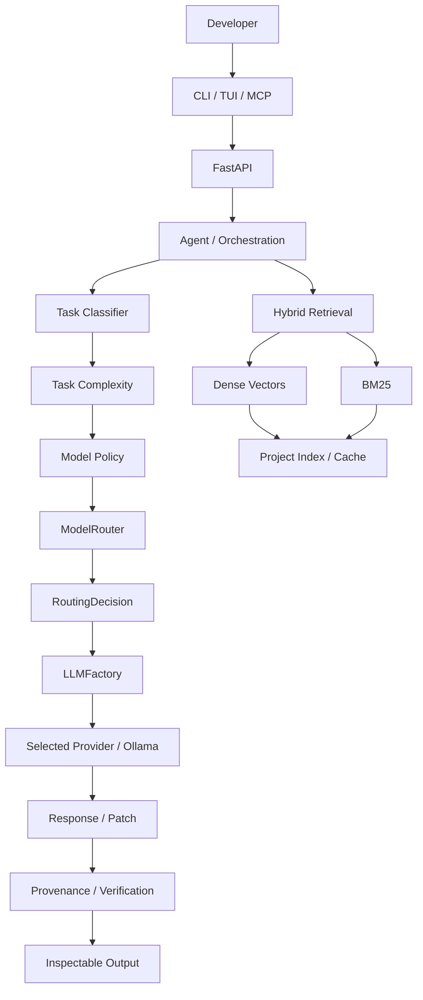
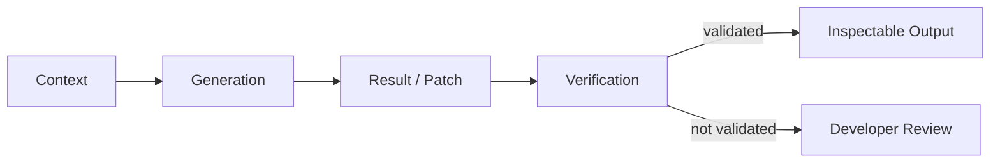
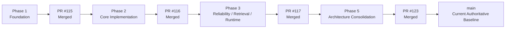

# Codemaster-AI 🚀

> **Local-first • Terminal-first • Project-aware AI coding**
>
> A coding engine built around project context, hybrid retrieval, agent orchestration, provider abstraction, unified model routing, patch workflows, and evidence-driven verification.

<p align="center">
  <strong>Created & Engineered by Sharfuddin Ahmed</strong><br>
  <sub>AI Vibe Coder • Systems Architect • Creator of Codemaster-AI</sub><br><br>
  <a href="https://github.com/sharfuddin18">@sharfuddin18</a>
</p>

<p align="center">
  <a href="https://github.com/sharfuddin18/Codemaster-Ai/actions"></a>
  <a href="https://github.com/sharfuddin18/Codemaster-Ai/security/code-scanning"></a>
  <a href="https://www.python.org/"></a>
  <a href="https://fastapi.tiangolo.com/"></a>
  <a href="https://ollama.com/"></a>
  <a href="https://github.com/sharfuddin18/Codemaster-Ai/blob/main/LICENSE.txt"></a>
</p>

<p align="center"><strong>Phase 1 ✅ · Phase 2 ✅ · Phase 3 ✅ · Phase 5 ✅</strong></p>

---

## 🧭 Current Engineering State

| Item | Current state |
|---|---|
| **Creator / Maintainer** | **Sharfuddin Ahmed · `sharfuddin18`** |
| **Branch** | `main` — authoritative integration branch |
| **Completed phases** | Phase 1 + Phase 2 + Phase 3 + Phase 5 |
| **Phase 3 PR** | [#117 — merged](https://github.com/sharfuddin18/Codemaster-Ai/pull/117) |
| **Phase 5 PR** | [#123 — merged](https://github.com/sharfuddin18/Codemaster-Ai/pull/123) |
| **Current main HEAD** | `a3947956ccb714d2e7c1c794e1229f534f1d629b` |
| **Phase 5 focus** | Unified model-routing and provider architecture |
| **Release state** | Engineering verification continues |

> **Evidence before claims:** `Implemented → Tested → Verified → CI Verified → Integrated → Release-Ready`

---

## 🎯 Mission

**Build a project-aware AI coding engine that helps developers understand, generate, review, and modify code while keeping the developer in control of the repository.**

```text
Developer intent
      ↓
Project context
      ↓
Retrieval + task classification
      ↓
Unified model routing
      ↓
Provider / model
      ↓
Result / patch
      ↓
Verification + provenance
      ↓
Developer review
```

## 🔭 Vision

Codemaster-AI is evolving toward a **terminal-centered, inspectable coding platform**:

- 🖥️ **Terminal-first** — CLI / TUI workflows
- 🔒 **Local-first** — Ollama local inference path
- 🧠 **Project-aware** — repository-level context
- 🔎 **Hybrid RAG** — dense vectors + BM25
- 🧩 **Provider-agnostic** — one factory/provider boundary
- 🧭 **Unified routing** — one authoritative model-selection path
- 🤖 **Agent-oriented** — explicit coding workflows
- 🩹 **Patch-oriented** — review changes before applying
- 📚 **Evidence-driven** — provenance + verification

---

# 🏗️ Architecture



**Phase 5 architectural rule:** `ModelRouter` is the single authoritative production model-routing boundary, and `LLMFactory` is the single provider-instantiation boundary. Retrieval remains an independent context subsystem.

[Architecture details →](ARCHITECTURE.md)

---

# 🧱 Technical Stack

| Layer | Technology | Purpose |
|---|---|---|
| Runtime | **Python 3.12+** | Core implementation |
| API | **FastAPI + Pydantic** | Application boundary + models |
| Local AI | **Ollama** | Local LLM execution |
| Routing | **TaskClassifier + ModelPolicy + ModelRouter** | Deterministic task/model selection |
| Providers | **LLM Factory** | Single provider-instantiation boundary |
| Retrieval | **Dense + BM25** | Hybrid project context |
| Embeddings | **`all-MiniLM-L6-v2`** | Semantic representation |
| Vectors | **FAISS / vector services** | Similarity retrieval |
| State | **TinyDB / local state** | Persistence |
| Agents | **Code Agent** | Coding + orchestration |
| Interface | **CLI + Textual/Rich TUI** | Terminal UX |
| Integration | **MCP** | External tool boundary |
| Changes | **`.patch` + Git** | Reviewable modifications |
| Verification | **pytest + flake8** | Automated checks |
| Security | **CodeQL** | Code/security analysis |
| CI/CD | **GitHub Actions** | Integration gate |
| Dependencies | **Dependabot** | Update automation |

---

# 🧠 Core Systems

### 🔎 Hybrid RAG

```text
                    User query
                        │
              ┌─────────┴─────────┐
              ↓                   ↓
        Dense retrieval       BM25 retrieval
              │                   │
              └─────────┬─────────┘
                        ↓
                 Hybrid ranking
                        ↓
                Relevant context
                        ↓
                  Agent / LLM
```

Dense retrieval captures semantic similarity; BM25 helps with exact identifiers, symbols, configuration keys, and terminology.

Phase 3 hardened and regression-tested the hybrid path so dense and BM25 signals both participate in ranking. Retrieval validation covers top-k handling, empty/no-result behavior, metadata/provenance, and controlled retrieval failures.

### ⚡ Incremental indexing

```text
File
 ↓
Hash
 ↓
Previous State
 ↓
Unchanged → Reuse / Skip
Changed   → Reprocess
Deleted   → Invalidate
New       → Process
```

Phase 3 verified unchanged-file reuse, changed/deleted-file invalidation, cache persistence/reload, and index/cache consistency to prevent stale repository context.

### 🗃️ Vector persistence and failure state

Phase 3 verified vector-index creation, embedding insertion, similarity search, FAISS persistence/reload, embedding-dimension metadata validation, corrupted/incompatible persistence handling, rebuild behavior, and explicit vector-index failure state.

A reliability defect was corrected where an indexing failure could be logged/skipped and leave a partially built index appearing usable. The vector engine now surfaces the indexing failure instead of incorrectly reporting a successful `READY` state.

### 🧭 Unified model routing

Phase 5 consolidated production model selection into one explicit path:

```text
User Request
    ↓
TaskClassifier
    ↓
TaskComplexity
    ↓
ModelPolicy
    ↓
ModelRouter
    ↓
RoutingDecision
    ↓
LLMFactory
    ↓
Selected Provider / Ollama
    ↓
Response / AgentResult
```

The routing vocabulary is represented by structured types including `TaskType`, `TaskComplexity`, `AgentRequest`, `ModelPolicy`, `RoutingDecision`, and `AgentResult`.

Phase 5 retired the duplicate production `ProviderManager` and simulated `ModelOrchestrator` paths. `ollama_service.py` retains only low-level compatibility helpers and a compatibility model-selection facade that delegates to `ModelRouter`; it no longer owns an independent model-selection table.

The Phase 5 policy preserves the repository's existing model names and deterministic routing behavior. It does not claim unsupported providers or live model capabilities that are unavailable in the execution environment.

### 🤖 Agent + provider flow

```text
Request
   ↓
Task Classification
   ↓
Unified Model Routing
   ↓
Retrieval / Context Assembly
   ↓
Agent
   ↓
LLMFactory
   ↓
Selected Provider
   ↓
Response / AgentResult
```

Phase 3 established retrieval and provider failure handling. Phase 5 makes the routing and provider boundaries explicit and shared across production generation/fix flows.

Provider behavior includes factory/provider selection, model selection, availability handling, provider exceptions, malformed/empty responses, and disabled-provider behavior. Local versus cloud providers remain distinct. Live Ollama model execution remains environment-dependent.

### 📚 Provenance



> **An LLM-generated answer is not considered trustworthy merely because generation succeeded.**

Phase 3 routes generation context through hybrid retrieval and preserves retrieval metadata/provenance for response verification.

### 🧯 Runtime reliability

Applicable FastAPI runtime paths were exercised through the real application/TestClient environment, including application initialization, request validation, successful generation flow, retrieval failure handling, provider failure handling, and response/error behavior. MCP capabilities and the `retrieve`, `generate`, and `fix` routes were exercised through runtime tests with request validation and controlled retrieval/provider failures.

Patch safety coverage includes valid and malformed patches, invalid and unsafe paths, path traversal protection, patch conflicts/failures, successful application, and post-application verification. Unsafe paths are rejected before patch application.

Phase 5 adds routing-level validation for unsupported providers, empty requests, malformed routing decisions, deterministic policy behavior, factory integration, compatibility delegation, and structured agent results.

---

# 🖥️ Developer Workflow

```text
                 ┌─────────────────────┐
                 │     Developer       │
                 └──────────┬──────────┘
                            │
                ┌───────────┼───────────┐
                ↓           ↓           ↓
              CLI         TUI          MCP
                │           │           │
                └───────────┼───────────┘
                            ↓
                     Codemaster-AI
                            ↓
              Context + Routing + Agents
                            ↓
                     Provider / Model
```

### 🩹 Patch workflow

```text
AI request → Context → Routing → Generation → Patch
                                                ↓
                                        Developer review
                                                ↓
                                            git apply
                                                ↓
                                        Repository change
                                                ↓
                                           Verification
```

---

# 🧪 Verification Model

```text
PLANNED
   ↓
IMPLEMENTED
   ↓
TESTED
   ↓
VERIFIED
   ↓
CI VERIFIED
   ↓
INTEGRATED
   ↓
RELEASE READY
```

| State | Evidence |
|---|---|
| **Implemented** | Code exists |
| **Tested** | Tests executed |
| **Verified** | Expected behavior established |
| **CI Verified** | Repository automation passed |
| **Integrated** | Merged into `main` |
| **Release-Ready** | Broader runtime, security, dependency, documentation, and release gates satisfied |

> **A passing test proves tested behavior — not complete system correctness.**

---

# 🧩 Phase History



### Phase 1 — Foundation

**✅ Complete / Verified / Merged**

Repository structure, environment configuration, dependency/test foundation, security hygiene, generated-artifact cleanup, and Git baseline.

### Phase 2 — Core Implementation & Integration

**✅ Complete / Verified / Merged** · `52efb62` · [PR #116](https://github.com/sharfuddin18/Codemaster-Ai/pull/116) · merge `7368bb3`

Integrated FastAPI routes, LLM abstraction/factory, Ollama/OpenAI/fallback providers, code-agent wiring, vector service, MCP routes, and provenance verification.

**Verification:** `19` phase tests passed · `40` backend tests passed · `0` failures · `0` errors · `1` non-blocking warning.

> Phase 2 is frozen as a completed integration boundary.

### Phase 3 — Reliability, Retrieval & Runtime Verification

**✅ Complete / Verified / Merged** · `a3ada5ebf96e6dc65378e6397fc6e4b38d58e513` · [PR #117](https://github.com/sharfuddin18/Codemaster-Ai/pull/117)

Phase 3 hardened hybrid dense + BM25 retrieval, validated ranking participation and retrieval edge cases, strengthened FAISS persistence/reload and vector-index failure handling, verified incremental cache invalidation and stale-context prevention, exercised provider and agent failure paths, and verified applicable FastAPI, MCP, and patch runtime paths.

Regression coverage includes hybrid ranking, vector indexing failure, persistence/reload, cache invalidation, provider behavior, retrieval failures, MCP/runtime behavior, and patch validation.

**Verification:** `57` tests passed at the final Phase 3 HEAD; Python 3.10 CI passed; Python 3.11 CI passed; Flake8 passed; CodeQL passed; `pip check` passed in the final verification environment.

**Known non-blocking warning:** Starlette/httpx TestClient deprecation warning under FastAPI `0.141.1`, Starlette `1.6.0`, and httpx `0.28.1`. Live Ollama model execution remains environment-dependent and was not claimed as live Phase 3 verification.

> Phase 3 is documented from its verified implementation and test evidence. No broader reliability or performance guarantee is implied.

### Phase 5 — Architecture Consolidation & Unified Model Routing

**✅ Complete / Integrated** · [PR #123](https://github.com/sharfuddin18/Codemaster-Ai/pull/123) · merge `a3947956ccb714d2e7c1c794e1229f534f1d629b`

Phase 5 eliminated production architecture duplication around provider/model selection and established one authoritative routing path.

Implemented and integrated:

- `TaskType` and `TaskComplexity` routing vocabulary;
- structured `AgentRequest` and `AgentResult` boundaries;
- deterministic `ModelPolicy` behavior;
- authoritative `ModelRouter` and structured `RoutingDecision`;
- `LLMFactory` as the single provider-instantiation boundary;
- production generation/fix convergence on the unified routing path;
- retirement of the duplicate production `ProviderManager` abstraction;
- retirement of the simulated `ModelOrchestrator` abstraction;
- compatibility delegation from the legacy Ollama model-selection facade to `ModelRouter`;
- corrected task-classification/routing precedence;
- updated stale MCP test mocks to match the consolidated architecture;
- dedicated routing/factory regression coverage.

Phase 5 did **not** invent new provider capabilities or remove the actual Ollama provider. The provider receives a model already selected by the routing layer. Live Ollama execution remains environment-dependent.

> **Phase 5 architectural outcome:** one authoritative production model-routing path and one provider-instantiation boundary, with retrieval remaining a separate context subsystem.

---

# 🔀 Branch & PR Governance

```text
main
 │
 └── phase-<purpose>
        ↓
     Implement
        ↓
   Test / Diagnose / Fix
        ↓
      Verify
        ↓
   Pull Request → main
        ↓
   CI/CD + CodeQL
        ↓
      Review
        ↓
      Merge
        ↓
  Retire temporary branch
```

`main` is the authoritative integration branch. Phase branches are temporary development boundaries and should not contain unrelated work.

---

# ⚙️ CI/CD & Security

```text
Local tests
    ↓
Commit + Push
    ↓
Pull Request
    ↓
GitHub Actions
 ┌───────────────────────┐
 │ pytest                │
 │ flake8                │
 │ pip check             │
 │ CodeQL                │
 │ Dependency checks     │
 └───────────┬───────────┘
             ↓
        Review → Merge
             ↓
            main
```

Local success and CI success are treated as **separate evidence boundaries**.

---

# 📊 Engineering Status

```text
PHASE 1  ████████████████████  COMPLETE / VERIFIED / MERGED
PHASE 2  ████████████████████  COMPLETE / VERIFIED / MERGED
PHASE 3  ████████████████████  COMPLETE / VERIFIED / MERGED
PHASE 5  ████████████████████  COMPLETE / INTEGRATED
```

| Area | Status |
|---|---|
| Repository foundation | 🟢 Complete / Verified |
| Core application integration | 🟢 Complete / Verified |
| Hybrid retrieval | 🟢 Complete / Verified in Phase 3 scope |
| Vector persistence / failure handling | 🟢 Complete / Verified in Phase 3 scope |
| Patch safety | 🟢 Complete / Verified in Phase 3 scope |
| Provider abstraction | 🟢 Consolidated |
| Model routing | 🟢 **Unified in Phase 5** |
| `ModelRouter` | 🟢 **Authoritative production router** |
| `LLMFactory` | 🟢 **Single provider-instantiation boundary** |
| ProviderManager | 🟢 Retired from production architecture |
| ModelOrchestrator | 🟢 Retired from production architecture |
| MCP | 🟢 Integrated / tested in existing scope |
| Provenance | 🟢 Integrated / tested in existing scope |
| Phase 5 routing tests | 🟢 Added |
| Current main | 🟢 Phase 5 merged |
| Release readiness | 🟡 Still requires broader project-level verification |

> The Phase 3 test/CI figures above are historical evidence for the Phase 3 HEAD. They are not presented as fresh post-Phase-5 CI results.

---

# 🚦 Release Gate

Release readiness requires evidence across:

**Implementation · Tests · Runtime · LLM/providers · RAG · Dependencies · Security · CI/CD · Documentation · Metadata · Git history · Feature verification**

**Current position:** Phases 1, 2, 3, and 5 are integrated into `main`. The project is **not described as fully release-ready solely because those phases are complete**; broader current-`main` verification remains a separate evidence gate.

---

# 🗺️ Roadmap

| Phase | Focus | Status |
|---|---|---|
| **1** | Foundation | ✅ Complete |
| **2** | Core implementation + integration | ✅ Complete |
| **3** | Reliability, retrieval + runtime verification | ✅ Complete |
| **5** | Architecture consolidation + unified model routing | ✅ Complete / Integrated |
| **Next** | Current-main verification and next engineering phase | ⏭️ Next |

> Phase numbering follows the completed engineering work recorded in the repository. No unverified Phase 4 scope is invented here.

---

# 🚀 Quickstart

### Prerequisites

- Python **3.12+**
- [Ollama](https://ollama.com/) for local inference
- Git
- Optional: Docker

### Install

```bash
git clone https://github.com/sharfuddin18/Codemaster-Ai.git
cd Codemaster-Ai

python -m venv .venv
source .venv/bin/activate
python -m pip install -r requirements.txt
python -m pip install -r backend/requirements.txt
```

Windows PowerShell:

```powershell
.\.venv\Scripts\Activate.ps1
```

### Configure

```bash
cp backend/.env.example backend/.env
```

For local Ollama inference:

```text
LLM_PROVIDER=ollama
OLLAMA_ENABLED=true
OLLAMA_BASE_URL=http://localhost:11434
```

### Run

```bash
cd backend
uvicorn app.main:app --host 0.0.0.0 --port 8000 --reload
```

API docs: `http://localhost:8000/docs`

### TUI

```bash
python run_tui.py
```

---

# 🧪 Testing

```bash
# Project tests
PYTHONPATH=.:backend:backend/app pytest -v

# CI-equivalent invocation
PYTHONPATH=.:backend pytest --import-mode=importlib backend/ tests/

# Benchmark
python run_benchmark.py
```

**Phase 2 record:** `19` phase-specific tests passed · `40` full backend tests passed · `0` failures · `0` errors · `1` warning.

**Phase 3 record:** `57` tests passed at final Phase 3 HEAD `a3ada5ebf96e6dc65378e6397fc6e4b38d58e513`; Python 3.10 and 3.11 CI passed; Flake8 and CodeQL passed. The known Starlette/httpx TestClient deprecation warning is non-blocking and documented above.

**Phase 5 scope:** dedicated routing tests cover task classification, complexity, deterministic model policy, structured routing decisions, unsupported providers, `LLMFactory` integration, compatibility delegation, and `AgentResult`. These are architectural regression tests; they do not claim live Ollama execution.

---

# 📁 Repository Map

```text
Codemaster-Ai/
├── backend/
│   ├── app/
│   │   ├── agents/
│   │   ├── llm/
│   │   │   ├── factory.py
│   │   │   ├── routing.py
│   │   │   └── providers/
│   │   ├── routes/
│   │   ├── services/
│   │   └── main.py
│   ├── tests/
│   ├── session_memory.py
│   └── tui_app.py
├── cli_tools/
├── tests/
├── data/
├── .github/workflows/
├── ARCHITECTURE.md
├── CONTRIBUTING.md
├── SECURITY.md
├── run_benchmark.py
├── run_tui.py
└── README.md
```

> Phase 5 retired the former production `backend/provider_manager.py` and `backend/model_orchestrator.py` abstractions. The repository map above therefore reflects the consolidated architecture rather than the historical pre-Phase-5 layout.

---

# 🛡️ Engineering Principles

1. 🔒 **Local-first where configured** — Ollama provides the local inference path.
2. 🧠 **Context before generation** — retrieval is part of the workflow.
3. 🧭 **One routing authority** — production model selection belongs to `ModelRouter`.
4. 🧩 **One provider boundary** — `LLMFactory` creates the selected provider.
5. 🩹 **Reviewable changes** — generated patches remain inspectable.
6. 📚 **Provenance matters** — generated output can be checked against context.
7. 🧪 **Tests are evidence** — results are recorded, not assumed.
8. ⚙️ **CI is independent evidence** — local success does not replace CI.
9. 🔐 **Secrets stay local** — credentials and `.env` state stay out of Git.
10. 📖 **Documentation follows reality** — claims change with implementation.
11. 🛠️ **Failures must be explicit** — genuine infrastructure failures should not appear as successful partial state.

---

# 🤝 Contributing

1. Read [`CONTRIBUTING.md`](CONTRIBUTING.md).
2. Create a focused development branch.
3. Implement → Test → Diagnose → Fix → Re-test → Verify.
4. Document meaningful changes.
5. Open a PR against `main`.
6. Pass CI/security checks before merge.

**Engineering lifecycle:**

`Plan → Implement → Diagnose → Test → Fix → Re-test → Verify → Document → Commit → Push → PR → CI → Review → Merge`

---

# 📚 Documentation

| Document | Purpose |
|---|---|
| [`ARCHITECTURE.md`](ARCHITECTURE.md) | System architecture and component boundaries |
| [`CONTRIBUTING.md`](CONTRIBUTING.md) | Development workflow |
| [`SECURITY.md`](SECURITY.md) | Security guidance |
| [`CODE_OF_CONDUCT.md`](CODE_OF_CONDUCT.md) | Community standards |
| [`LICENSE.txt`](LICENSE.txt) | MIT license |

---

# 🏁 Current Position

```text
PHASE 1  ████████████████████  COMPLETE / VERIFIED / MERGED
PHASE 2  ████████████████████  COMPLETE / VERIFIED / MERGED
PHASE 3  ████████████████████  COMPLETE / VERIFIED / MERGED
PHASE 5  ████████████████████  COMPLETE / INTEGRATED
NEXT     ░░░░░░░░░░░░░░░░░░░░  CURRENT-MAIN VERIFICATION / NEXT PHASE
```

> **Evidence before claims. Engineering before marketing.**

### Built by Sharfuddin Ahmed

**AI Vibe Coder · Systems Architect · Creator of Codemaster-AI**  
GitHub: [@sharfuddin18](https://github.com/sharfuddin18)

**Codemaster-AI · Phase-based engineering · Local AI · Unified model routing · Evidence-driven development** ☕🚀