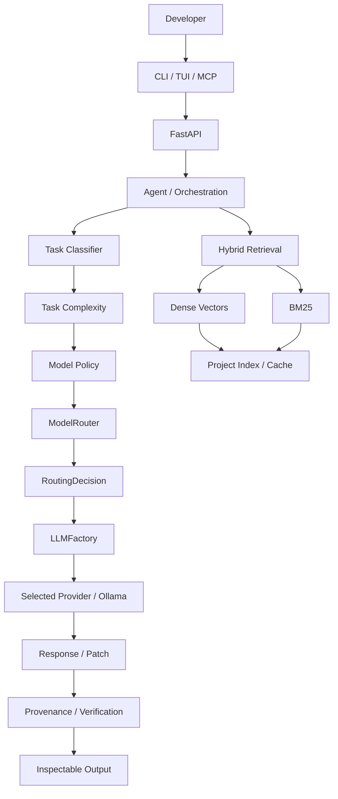
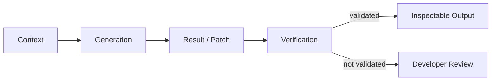

# Codemaster-AI 🚀

> **Local-first • Terminal-first • Project-aware AI coding**
>
> A coding engine built around project context, hybrid retrieval, agent workflows, provider abstraction, unified model routing, patch workflows, and evidence-driven verification.

<p align="center">
  <strong>Created & Engineered by Sharfuddin Ahmed</strong><br>
  <sub>AI Vibe Coder • Systems Architect • Creator of Codemaster-AI</sub><br><br>
  <a href="https://github.com/sharfuddin18">@sharfuddin18</a>
</p>

<p align="center">
  <a href="https://github.com/sharfuddin18/Codemaster-Ai/actions"></a>
  <a href="https://github.com/sharfuddin18/Codemaster-Ai/security/code-scanning"></a>
  <a href="https://www.python.org/"></a>
  <a href="https://fastapi.tiangolo.com/"></a>
  <a href="https://ollama.com/"></a>
  <a href="https://github.com/sharfuddin18/Codemaster-Ai/blob/main/LICENSE.txt"></a>
</p>

---

## 🎯 What is Codemaster-AI?

Codemaster-AI is a project-aware AI coding engine designed to help developers **understand, generate, review, and modify software safely** while keeping the developer in control.

```text
Developer intent
      ↓
Project context + retrieval
      ↓
Task classification
      ↓
Unified model routing
      ↓
Provider / model
      ↓
Result / patch
      ↓
Verification + provenance
      ↓
Developer review
```

### Core capabilities

- 🧠 **Project-aware context** — repository-level understanding instead of isolated snippets.
- 🔎 **Hybrid RAG** — dense vectors + BM25 with persistent local indexing.
- 🧭 **Unified routing** — `TaskClassifier → ModelRouter → LLMFactory → Provider`.
- 🤖 **Agent workflows** — structured generation, fixing, context assembly, and results.
- 🩹 **Safe patching** — validation, traversal protection, application, and verification.
- 📚 **Provenance-aware output** — context can be traced back to retrieved sources.
- 🔌 **REST + CLI/TUI + MCP** — multiple interfaces over the same core architecture.
- 🔒 **Local-first inference** — Ollama remains the primary local execution path.

---

# 🏗️ Architecture



> **Architecture rule:** `ModelRouter` is the single authoritative production model-routing boundary. `LLMFactory` is the single provider-instantiation boundary. Retrieval remains an independent context subsystem.

[Architecture details →](ARCHITECTURE.md)

---

# 🧱 Technical Stack

| Layer | Technology | Purpose |
|---|---|---|
| Runtime | **Python 3.12+** | Core implementation |
| API | **FastAPI + Pydantic** | Application boundary |
| Local AI | **Ollama** | Local LLM execution |
| Routing | **TaskClassifier + ModelPolicy + ModelRouter** | Deterministic task/model selection |
| Providers | **LLMFactory** | Provider-instantiation boundary |
| Retrieval | **Dense + BM25 + FAISS** | Hybrid project context |
| Embeddings | **`all-MiniLM-L6-v2`** | Semantic representation |
| Agents | **Code Agent** | Coding and orchestration |
| Interface | **CLI + Textual/Rich TUI** | Terminal UX |
| Integration | **MCP** | Tool/context boundary |
| Changes | **Patch + Git** | Reviewable modifications |
| Verification | **pytest + Flake8 + CodeQL** | Automated checks |

---

# 🧠 Core Systems

### 🔎 Hybrid RAG

```text
                    User query
                        │
              ┌─────────┴─────────┐
              ↓                   ↓
        Dense retrieval       BM25 retrieval
              │                   │
              └─────────┬─────────┘
                        ↓
                 Hybrid ranking
                        ↓
                Relevant context
                        ↓
                  Agent / LLM
```

Dense retrieval captures semantic similarity while BM25 strengthens exact identifiers, symbols, configuration keys, and terminology. The retrieval layer supports incremental indexing, persistent vector state, deterministic ranking, provenance, and explicit failure handling.

### ⚡ Incremental indexing

```text
File
 ↓
Hash
 ↓
Previous State
 ↓
Unchanged → Reuse / Skip
Changed   → Reprocess
Deleted   → Invalidate
New       → Process
```

### 🧭 Unified model routing

```text
Request
   ↓
TaskClassifier
   ↓
TaskType + TaskComplexity
   ↓
ModelPolicy
   ↓
ModelRouter
   ↓
RoutingDecision
   ↓
LLMFactory
   ↓
Provider / Ollama
   ↓
AgentResult
```

Routing is represented through explicit concepts including `TaskType`, `TaskComplexity`, `AgentRequest`, `ModelPolicy`, `RoutingDecision`, and `AgentResult`. Production model selection is centralized in `ModelRouter`; provider creation is centralized in `LLMFactory`.

The production architecture no longer relies on duplicate `ProviderManager` or simulated `ModelOrchestrator` routing paths. Ollama remains the primary local provider path; live model execution depends on the configured environment.

### 📚 Provenance & verification



> **Successful generation is not treated as proof of correctness.**

---

# 🖥️ Developer Workflow

```text
                 ┌─────────────────────┐
                 │     Developer       │
                 └──────────┬──────────┘
                            │
                ┌───────────┼───────────┐
                ↓           ↓           ↓
              CLI         TUI          MCP
                │           │           │
                └───────────┼───────────┘
                            ↓
                     Codemaster-AI
                            ↓
              Context + Routing + Agents
                            ↓
                     Provider / Model
```

### 🩹 Patch workflow

```text
AI request → Context → Routing → Generation → Patch
                                                ↓
                                        Developer review
                                                ↓
                                           Apply safely
                                                ↓
                                        Repository change
                                                ↓
                                           Verification
```

Patch handling includes malformed/empty patch handling, unsafe-path rejection, traversal protection, conflict handling, and post-application verification.

---

# 🧪 Engineering & Verification

The project uses automated regression testing across retrieval, routing, providers, MCP, patch safety, and application workflows.

Verification focuses on:

- hybrid retrieval and deterministic ranking
- vector persistence and indexing failure handling
- provider and routing behavior
- MCP/runtime paths
- patch security and verification
- structured agent results
- API/application integration

```text
IMPLEMENTED → TESTED → VERIFIED → CI VERIFIED → INTEGRATED → RELEASE READY
```

> **A passing test proves tested behavior — not complete system correctness.** Live LLM execution remains dependent on the configured provider environment.

---

# 🚀 Getting Started

### Install

```bash
git clone https://github.com/sharfuddin18/Codemaster-Ai.git
cd Codemaster-Ai
python -m venv .venv
source .venv/bin/activate
python -m pip install -r requirements.txt
python -m pip install -r backend/requirements.txt
```

Windows PowerShell:

```powershell
.\.venv\Scripts\Activate.ps1
```

### Configure local inference

```bash
cp backend/.env.example backend/.env
```

```text
LLM_PROVIDER=ollama
OLLAMA_ENABLED=true
OLLAMA_BASE_URL=http://localhost:11434
```

### Run

```bash
cd backend
uvicorn app.main:app --host 0.0.0.0 --port 8000 --reload
```

### Run tests

```bash
PYTHONPATH=.:backend pytest --import-mode=importlib backend/ tests/
```

---

# 📁 Project Structure

```text
Codemaster-Ai/
├── backend/              # FastAPI application and core services
├── cli_tools/            # CLI / terminal workflows
├── tests/                # Regression and integration tests
├── data/                 # Local runtime and indexing state
├── ARCHITECTURE.md       # Detailed architecture reference
├── CONTRIBUTING.md       # Contribution workflow
├── SECURITY.md           # Security guidance
└── README.md             # Project overview
```

---

# 📌 Current Status

**Codemaster-AI's core architecture is consolidated around a single model-routing and provider-factory design, with hybrid retrieval, agent workflows, safe patching, provenance, MCP, and terminal/API interfaces in place.**

The project continues toward stronger end-to-end runtime verification, reproducible environments, and reliable AI-assisted software engineering workflows.

## 📄 Documentation

- [`ARCHITECTURE.md`](ARCHITECTURE.md) — detailed architecture and design boundaries
- [`CONTRIBUTING.md`](CONTRIBUTING.md) — development workflow
- [`SECURITY.md`](SECURITY.md) — security guidance
- [`tests/`](tests/) — automated verification

## 🤝 Contributing

Contributions and architectural discussions are welcome. Keep changes focused, tested, and aligned with the project's routing, retrieval, provider, and verification boundaries.

## 📜 License

MIT License.

---

<p align="center">
  <strong>Built by Sharfuddin Ahmed</strong><br>
  <sub>AI Vibe Coder • Systems Architect • Creator of Codemaster-AI</sub>
</p>