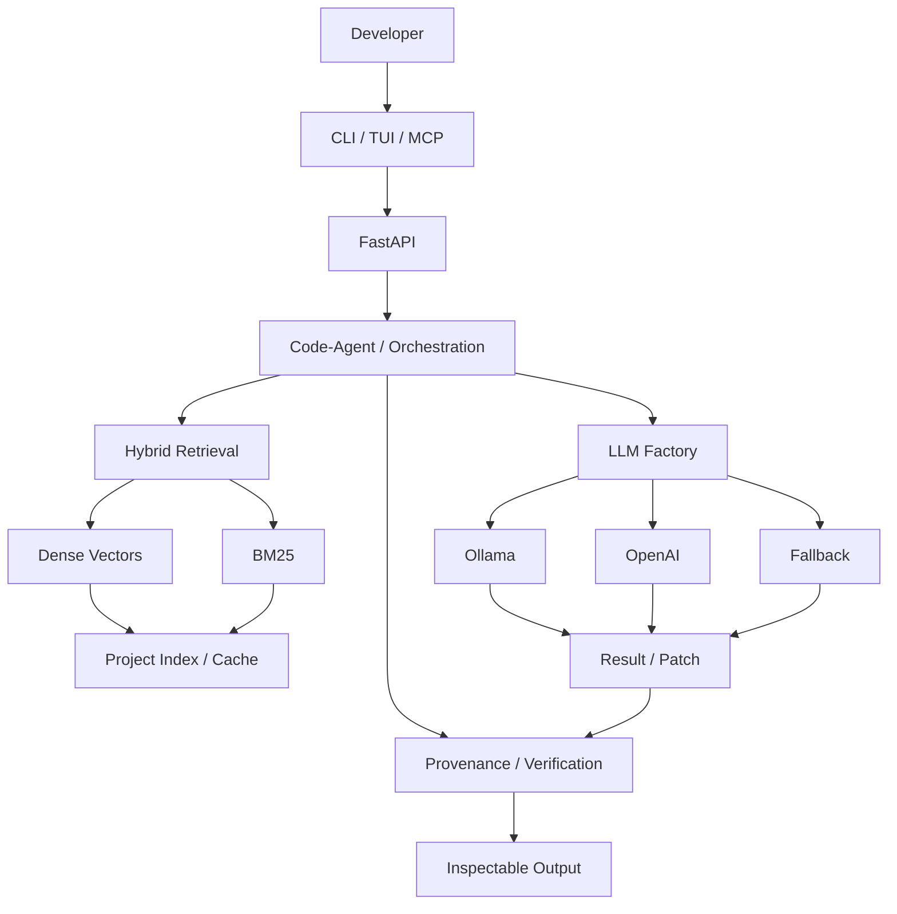
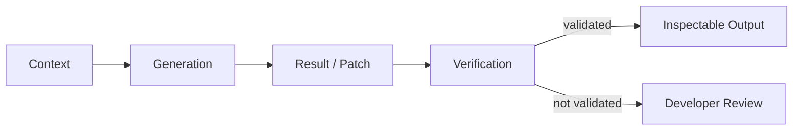
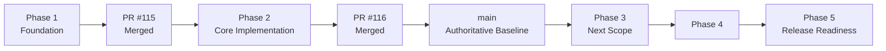

# Codemaster-AI 🚀

> **Local-first • Terminal-first • Project-aware AI coding**
>
> A coding engine built around project context, hybrid retrieval, agent orchestration, provider abstraction, patch workflows, and evidence-driven verification.

<p align="center">
  <strong>Created & Engineered by Sharfuddin Ahmed</strong><br>
  <sub>AI Vibe Coder • Systems Architect • Creator of Codemaster-AI</sub><br><br>
  <a href="https://github.com/sharfuddin18">@sharfuddin18</a>
</p>

<p align="center">
  <a href="https://github.com/sharfuddin18/Codemaster-Ai/actions"></a>
  <a href="https://github.com/sharfuddin18/Codemaster-Ai/security/code-scanning"></a>
  <a href="https://www.python.org/"></a>
  <a href="https://fastapi.tiangolo.com/"></a>
  <a href="https://ollama.com/"></a>
  <a href="https://github.com/sharfuddin18/Codemaster-Ai/blob/main/LICENSE.txt"></a>
</p>

<p align="center"><strong>Phase 1 ✅ · Phase 2 ✅ · Phase 3 ⏳</strong></p>

---

## 🧭 Current Engineering State

| Item | Current state |
|---|---|
| **Creator / Maintainer** | **Sharfuddin Ahmed · `sharfuddin18`** |
| **Branch** | `main` — authoritative integration branch |
| **Completed phases** | Phase 1 + Phase 2 |
| **Phase 2 PR** | [#116 — merged](https://github.com/sharfuddin18/Codemaster-Ai/pull/116) |
| **Phase 2 commit** | `52efb62` → merge `7368bb3` |
| **Verification** | **40 passed · 0 failed · 0 errors · 1 warning** |
| **Release state** | Engineering verification in progress |

> **Evidence before claims:** `Implemented → Tested → Verified → CI Verified → Integrated → Release-Ready`

---

## 🎯 Mission

**Build a project-aware AI coding engine that helps developers understand, generate, review, and modify code while keeping the developer in control of the repository.**

```text
Developer intent
      ↓
Project context
      ↓
Retrieval + orchestration
      ↓
Model provider
      ↓
Result / patch
      ↓
Verification + provenance
      ↓
Developer review
```

## 🔭 Vision

Codemaster-AI is evolving toward a **terminal-centered, inspectable coding platform**:

- 🖥️ **Terminal-first** — CLI / TUI workflows
- 🔒 **Local-first** — Ollama local inference path
- 🧠 **Project-aware** — repository-level context
- 🔎 **Hybrid RAG** — dense vectors + BM25
- 🧩 **Provider-agnostic** — factory/provider abstraction
- 🤖 **Agent-oriented** — explicit coding workflows
- 🩹 **Patch-oriented** — review changes before applying
- 📚 **Evidence-driven** — provenance + verification

---

# 🏗️ Architecture



**Design rule:** routing, retrieval, agents, providers, generation, patches, and verification remain explicit architectural responsibilities.

[Architecture details →](ARCHITECTURE.md)

---

# 🧱 Technical Stack

| Layer | Technology | Purpose |
|---|---|---|
| Runtime | **Python 3.12+** | Core implementation |
| API | **FastAPI + Pydantic** | Application boundary + models |
| Local AI | **Ollama** | Local LLM execution |
| Providers | **LLM Factory** | Model/provider isolation |
| Retrieval | **Dense + BM25** | Hybrid project context |
| Embeddings | **`all-MiniLM-L6-v2`** | Semantic representation |
| Vectors | **FAISS / vector services** | Similarity retrieval |
| State | **TinyDB / local state** | Persistence |
| Agents | **Code Agent** | Coding + orchestration |
| Interface | **CLI + Textual/Rich TUI** | Terminal UX |
| Integration | **MCP** | External tool boundary |
| Changes | **`.patch` + Git** | Reviewable modifications |
| Verification | **pytest + flake8** | Automated checks |
| Security | **CodeQL** | Code/security analysis |
| CI/CD | **GitHub Actions** | Integration gate |
| Dependencies | **Dependabot** | Update automation |

---

# 🧠 Core Systems

### 🔎 Hybrid RAG

```text
                    User query
                        │
              ┌─────────┴─────────┐
              ↓                   ↓
        Dense retrieval       BM25 retrieval
              │                   │
              └─────────┬─────────┘
                        ↓
                 Hybrid ranking
                        ↓
                Relevant context
                        ↓
                  Agent / LLM
```

Dense retrieval captures semantic similarity; BM25 helps with exact identifiers, symbols, configuration keys, and terminology.

### ⚡ Incremental indexing

```text
Repository → Traverse → Hash/state check
                         ↓
                ┌────────┴────────┐
              unchanged        changed
                  ↓                ↓
                 skip         embed/update
                  └────────┬───────┘
                           ↓
                    Vector / cache state
```

### 🤖 Agent + provider flow

```text
Request → Routing → Retrieval → Agent → Provider
                                      ↓
                              Ollama / OpenAI / Fallback
                                      ↓
                              Response / Patch
                                      ↓
                              Verification
```

### 📚 Provenance



> **An LLM-generated answer is not considered trustworthy merely because generation succeeded.**

---

# 🖥️ Developer Workflow

```text
                 ┌─────────────────────┐
                 │     Developer       │
                 └──────────┬──────────┘
                            │
                ┌───────────┼───────────┐
                ↓           ↓           ↓
              CLI         TUI          MCP
                │           │           │
                └───────────┼───────────┘
                            ↓
                     Codemaster-AI
                            ↓
                 Context + Agents + LLM
```

### 🩹 Patch workflow

```text
AI request → Context → Generation → Patch
                                      ↓
                              Developer review
                                      ↓
                                  git apply
                                      ↓
                              Repository change
```

---

# 🧪 Verification Model

```text
PLANNED
   ↓
IMPLEMENTED
   ↓
TESTED
   ↓
VERIFIED
   ↓
CI VERIFIED
   ↓
INTEGRATED
   ↓
RELEASE READY
```

| State | Evidence |
|---|---|
| **Implemented** | Code exists |
| **Tested** | Tests executed |
| **Verified** | Expected behavior established |
| **CI Verified** | Repository automation passed |
| **Integrated** | Merged into `main` |
| **Release-Ready** | Broader runtime, security, dependency, documentation, and release gates satisfied |

> **A passing test proves tested behavior — not complete system correctness.**

---

# 🧩 Phase History



### Phase 1 — Foundation

**✅ Complete / Verified / Merged**

Repository structure, environment configuration, dependency/test foundation, security hygiene, generated-artifact cleanup, and Git baseline.

### Phase 2 — Core Implementation & Integration

**✅ Complete / Verified / Merged** · `52efb62` · [PR #116](https://github.com/sharfuddin18/Codemaster-Ai/pull/116) · merge `7368bb3`

Integrated FastAPI routes, LLM abstraction/factory, Ollama/OpenAI/fallback providers, code-agent wiring, vector service, MCP routes, and provenance verification.

**Verification:** `19` phase tests passed · `40` backend tests passed · `0` failures · `0` errors · `1` non-blocking warning.

> Phase 2 is frozen as a completed integration boundary. Future work belongs in the next phase.

---

# 🔀 Branch & PR Governance

```text
main
 │
 └── phase-<purpose>
        ↓
     Implement
        ↓
   Test / Diagnose / Fix
        ↓
      Verify
        ↓
   Pull Request → main
        ↓
   CI/CD + CodeQL
        ↓
      Review
        ↓
      Merge
        ↓
  Retire temporary branch
```

`main` is the stable integration branch. Phase branches are temporary development boundaries and should not contain unrelated work.

---

# ⚙️ CI/CD & Security

```text
Local tests
    ↓
Commit + Push
    ↓
Pull Request
    ↓
GitHub Actions
 ┌───────────────────────┐
 │ pytest                │
 │ flake8                │
 │ pip check             │
 │ CodeQL                │
 │ Dependency checks     │
 └───────────┬───────────┘
             ↓
        Review → Merge
             ↓
            main
```

Local success and CI success are treated as **separate evidence boundaries**.

---

# 📊 Engineering Status

```text
PHASE 1  ████████████████████  COMPLETE / VERIFIED / MERGED
PHASE 2  ████████████████████  COMPLETE / VERIFIED / MERGED
PHASE 3  ░░░░░░░░░░░░░░░░░░░░  NEXT
PHASE 4  ░░░░░░░░░░░░░░░░░░░░  PLANNED
PHASE 5  ░░░░░░░░░░░░░░░░░░░░  PLANNED
```

| Area | Status |
|---|---|
| Repository foundation | 🟢 Verified |
| Core application integration | 🟢 Verified |
| Provider/factory | 🟢 Verified in Phase 2 scope |
| Provenance | 🟢 Tested in Phase 2 scope |
| Backend tests | 🟢 **40 passed / 0 failed** |
| CI/CD | 🟢 Integrated boundary |
| CodeQL | 🟢 Configured |
| Release readiness | 🟡 In progress |
| Phase 3 | ⚪ Not started |

---

# 🚦 Release Gate

Release readiness requires evidence across:

**Implementation · Tests · Runtime · LLM/providers · RAG · Dependencies · Security · CI/CD · Documentation · Metadata · Git history · Feature verification**

**Current position:** Phase 1 and Phase 2 are complete; project-level release verification continues.

---

# 🗺️ Roadmap

| Phase | Focus | Status |
|---|---|---|
| **1** | Foundation | ✅ Complete |
| **2** | Core implementation + integration | ✅ Complete |
| **3** | Architecture / reliability | ⏳ Planned |
| **4** | Release engineering | ⏳ Planned |
| **5** | Final integration + release readiness | ⏳ Planned |

---

# 🚀 Quickstart

### Prerequisites

- Python **3.12+**
- [Ollama](https://ollama.com/) for local inference
- Git
- Optional: Docker

### Install

```bash
git clone https://github.com/sharfuddin18/Codemaster-Ai.git
cd Codemaster-Ai

python -m venv .venv
source .venv/bin/activate
python -m pip install -r requirements.txt
python -m pip install -r backend/requirements.txt
```

Windows PowerShell:

```powershell
.\.venv\Scripts\Activate.ps1
```

### Configure

```bash
cp backend/.env.example backend/.env
```

For local Ollama inference:

```text
LLM_PROVIDER=ollama
OLLAMA_ENABLED=true
OLLAMA_BASE_URL=http://localhost:11434
```

### Run

```bash
cd backend
uvicorn app.main:app --host 0.0.0.0 --port 8000 --reload
```

API docs: `http://localhost:8000/docs`

### TUI

```bash
python run_tui.py
```

---

# 🧪 Testing

```bash
# Project tests
PYTHONPATH=.:backend:backend/app pytest -v

# CI-equivalent invocation
PYTHONPATH=.:backend pytest --import-mode=importlib backend/ tests/

# Benchmark
python run_benchmark.py
```

**Phase 2 record:** `19` phase-specific tests passed · `40` full backend tests passed · `0` failures · `0` errors · `1` warning.

---

# 📁 Repository Map

```text
Codemaster-Ai/
├── backend/
│   ├── app/
│   │   ├── agents/
│   │   ├── llm/
│   │   ├── routes/
│   │   ├── services/
│   │   └── main.py
│   ├── tests/
│   ├── model_orchestrator.py
│   ├── provider_manager.py
│   └── tui_app.py
├── cli_tools/
├── tests/
├── data/
├── .github/workflows/
├── ARCHITECTURE.md
├── CONTRIBUTING.md
├── SECURITY.md
├── run_benchmark.py
├── run_tui.py
└── README.md
```

---

# 🛡️ Engineering Principles

1. 🔒 **Local-first where configured** — Ollama provides the local inference path.
2. 🧠 **Context before generation** — retrieval is part of the workflow.
3. 🧩 **Provider abstraction** — application logic stays decoupled from providers.
4. 🩹 **Reviewable changes** — generated patches remain inspectable.
5. 📚 **Provenance matters** — generated output can be checked against context.
6. 🧪 **Tests are evidence** — results are recorded, not assumed.
7. ⚙️ **CI is independent evidence** — local success does not replace CI.
8. 🔐 **Secrets stay local** — credentials and `.env` state stay out of Git.
9. 📖 **Documentation follows reality** — claims change with implementation.

---

# 🤝 Contributing

1. Read [`CONTRIBUTING.md`](CONTRIBUTING.md).
2. Create a focused development branch.
3. Implement → Test → Diagnose → Fix → Re-test → Verify.
4. Document meaningful changes.
5. Open a PR against `main`.
6. Pass CI/security checks before merge.

**Engineering lifecycle:**

`Plan → Implement → Diagnose → Test → Fix → Re-test → Verify → Document → Commit → Push → PR → CI → Review → Merge`

---

# 📚 Documentation

| Document | Purpose |
|---|---|
| [`ARCHITECTURE.md`](ARCHITECTURE.md) | System architecture and component boundaries |
| [`CONTRIBUTING.md`](CONTRIBUTING.md) | Development workflow |
| [`SECURITY.md`](SECURITY.md) | Security guidance |
| [`CODE_OF_CONDUCT.md`](CODE_OF_CONDUCT.md) | Community standards |
| [`LICENSE.txt`](LICENSE.txt) | MIT license |

---

# 🏁 Current Position

```text
PHASE 1  ████████████████████  COMPLETE
PHASE 2  ████████████████████  COMPLETE
PHASE 3  ░░░░░░░░░░░░░░░░░░░░  NEXT
PHASE 4  ░░░░░░░░░░░░░░░░░░░░  PLANNED
PHASE 5  ░░░░░░░░░░░░░░░░░░░░  PLANNED
```

> **Evidence before claims. Engineering before marketing.**

### Built by Sharfuddin Ahmed

**AI Vibe Coder · Systems Architect · Creator of Codemaster-AI**  
GitHub: [@sharfuddin18](https://github.com/sharfuddin18)

**Codemaster-AI · Phase-based engineering · Local AI · Evidence-driven development** ☕🚀