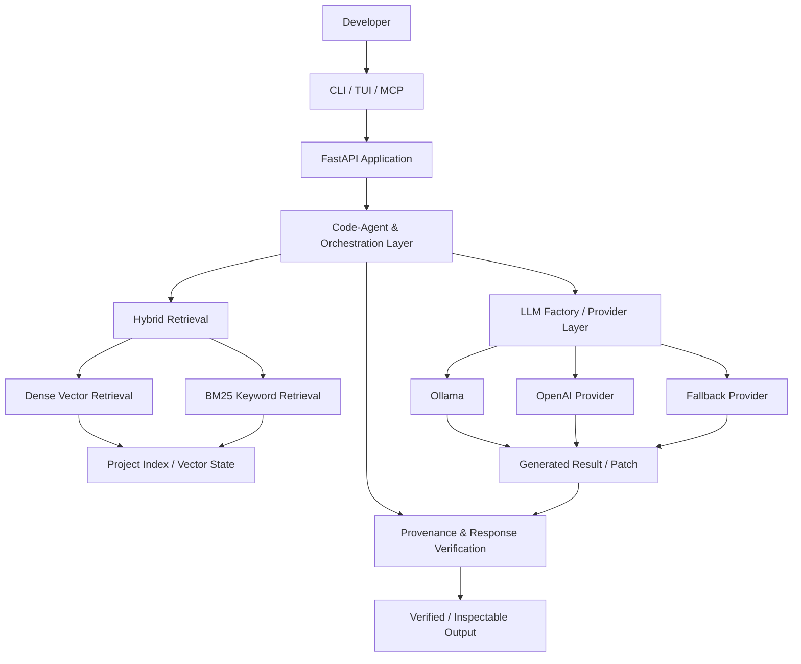
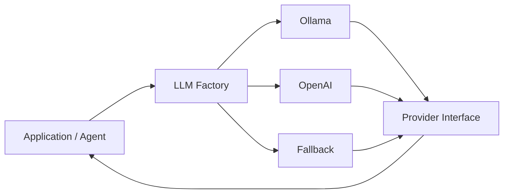
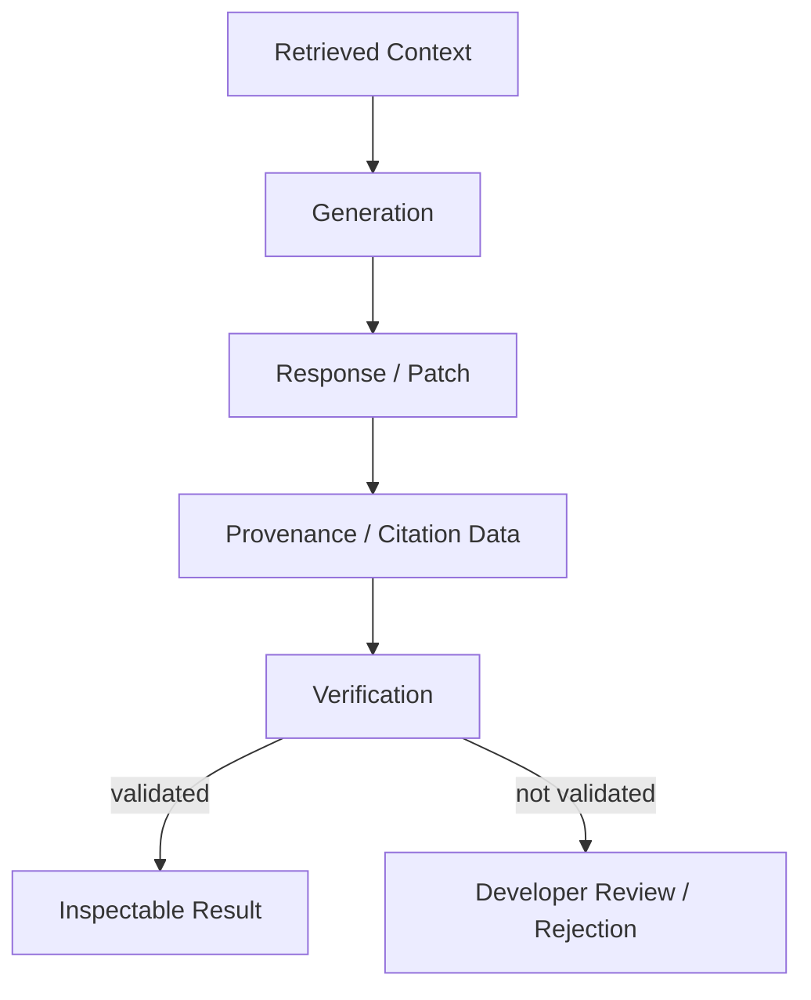
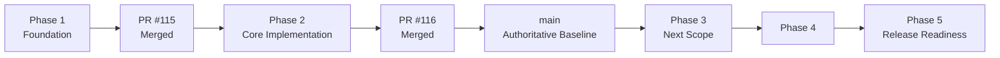
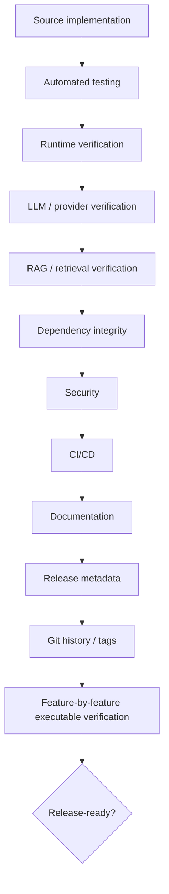

# Codemaster-AI 🚀

> **A local-first, terminal-first AI coding engine built around project context, hybrid retrieval, agent orchestration, provider abstraction, patch-based workflows, and evidence-driven verification.**

<p align="center">
  <a href="https://github.com/sharfuddin18/Codemaster-Ai/actions"></a>
  <a href="https://github.com/sharfuddin18/Codemaster-Ai/security/code-scanning"></a>
  <a href="https://www.python.org/"></a>
  <a href="https://fastapi.tiangolo.com/"></a>
  <a href="https://ollama.com/"></a>
  <a href="https://github.com/sharfuddin18/Codemaster-Ai/blob/main/LICENSE.txt"></a>
</p>

<p align="center">
  <strong>Engineering status: Phase 1 ✅ · Phase 2 ✅ · Phase 3 ⏳</strong>
</p>

---

## 🧭 Engineering Development Record — 11-08-2026

This README is the **current project-facing engineering overview** for `sharfuddin18/Codemaster-Ai` on `main`.

| Item | Current state |
|---|---|
| **Project** | Codemaster-AI |
| **Development model** | Phase-based implementation + verification |
| **Author / maintainer** | Sharfuddin Ahmed (`sharfuddin18`) |
| **Primary runtime target** | Python 3.12+ |
| **Application framework** | FastAPI |
| **Local inference path** | Ollama |
| **Current completed phase** | **Phase 2 — Core Implementation & Integration** |
| **Current authoritative branch** | `main` |
| **Phase 2 PR** | **#116 — merged into `main`** |
| **Phase 2 implementation commit** | `52efb62` |
| **Phase 2 merge commit** | `7368bb3` |
| **Phase 2 verification** | **40 passed · 0 failed · 0 errors · 1 warning** |
| **Release state** | Engineering development / verification — not yet declared final release-ready |

> **Evidence rule:** a module existing in the repository is not treated as proof that its full behavior is production-ready. Codemaster-AI distinguishes **Implemented → Tested → Verified → CI Verified → Integrated → Release-Ready**.

---

## 🎯 Mission

**Build a project-aware AI coding engine that helps developers understand, generate, review, and modify code without turning the development workflow into a cloud-dependent black box.**

Codemaster-AI is being engineered around a simple idea:

```text
Developer intent
      ↓
Project context
      ↓
Retrieval + orchestration
      ↓
Local / configured model provider
      ↓
Generated result or patch
      ↓
Verification + provenance
      ↓
Developer review
```

The goal is not merely to wrap an LLM in an HTTP endpoint. The goal is to build an **auditable coding workflow** in which context, model selection, generated changes, and verification remain explicit architectural responsibilities.

## 🔭 Vision

Codemaster-AI is evolving toward a **terminal-centered, project-aware coding platform** where the developer remains in control of the repository and the AI operates as an inspectable engineering assistant.

The long-term architectural direction is:

- 🖥️ **Terminal-first** — CLI/TUI workflows remain central.
- 🔒 **Local-first** — Ollama provides a local inference path when configured.
- 🧠 **Project-aware** — retrieval works across repository context instead of isolated snippets.
- 🔎 **Hybrid retrieval** — semantic vectors and lexical BM25 retrieval complement each other.
- 🧩 **Provider-agnostic** — model access is separated behind provider/factory abstractions.
- 🤖 **Agent-oriented** — generation, review, explanation, and routing can be separated into explicit responsibilities.
- 🩹 **Patch-oriented** — generated modifications can be reviewed as patches before application.
- 📚 **Evidence-oriented** — provenance and verification are first-class concerns.
- 🧪 **Verification-driven** — implementation claims are backed by executable evidence wherever applicable.

---

# 🏗️ Architecture at a Glance



### Architectural principle

The system is intentionally layered so that **HTTP routing, agent behavior, retrieval, provider selection, model execution, patch generation, and verification do not become one undifferentiated component**.

The current architecture is documented in [`ARCHITECTURE.md`](ARCHITECTURE.md).

---

# 🧱 Technical Stack

| Layer | Technology / Component | Role |
|---|---|---|
| Language | **Python 3.12+** | Primary implementation language / runtime target |
| API | **FastAPI** | Application and service boundary |
| Validation | **Pydantic / pydantic-settings** | Structured models and configuration |
| Local inference | **Ollama** | Local LLM execution path |
| Provider abstraction | **LLM Factory + providers** | Provider/model selection and isolation |
| Retrieval | **Dense vectors + BM25** | Hybrid project-context retrieval |
| Embeddings | **`all-MiniLM-L6-v2`** | Dense semantic representation |
| Vector layer | **FAISS / vector services** | Vector indexing and similarity retrieval |
| Persistence | **TinyDB / local state** | Application and session-oriented state |
| Agent layer | **Code Agent / specialized flows** | Coding, review, explanation and orchestration |
| Interface | **CLI + Textual/Rich TUI** | Terminal-first developer experience |
| Integration | **MCP endpoints** | External tool/editor integration boundary |
| Patch workflow | **`.patch` + Git** | Reviewable generated changes |
| Testing | **pytest** | Automated verification |
| Static analysis | **flake8** | Linting / syntax-risk checks |
| Security | **CodeQL** | Automated code/security analysis |
| CI/CD | **GitHub Actions** | Repository-level verification gate |
| Dependency hygiene | **Dependabot** | Dependency update automation |
| Benchmarking | **`run_benchmark.py`** | Performance / behavior benchmarking infrastructure |

> **Compatibility note:** the project-facing runtime target is Python 3.12+, while the current GitHub Actions Python workflow also exercises Python 3.10 and 3.11. This support-matrix alignment is tracked as engineering hygiene rather than being hidden by documentation.

---

# 🧠 Core Systems

## 1. Project-aware context

Codemaster-AI is designed around repository-level context rather than isolated prompts. The architecture brings together project indexing, retrieval, file relationships, vector representations, cached state, and provenance information.

## 2. Hybrid RAG

```text
                    User query
                        │
              ┌─────────┴─────────┐
              ↓                   ↓
        Dense retrieval       BM25 retrieval
              │                   │
              └─────────┬─────────┘
                        ↓
                 Hybrid ranking
                        ↓
                Relevant context
                        ↓
                 Agent / LLM flow
```

### Dense retrieval

Semantic retrieval is intended to capture conceptually related code even when exact keywords differ.

### BM25 retrieval

Lexical retrieval is valuable for exact identifiers, symbols, configuration keys, API names, and terminology.

### Hybrid retrieval

Combining both provides a broader retrieval signal than relying exclusively on embeddings or exact keyword matching.

---

## 3. Incremental indexing & cache direction

The indexing architecture is designed to avoid unnecessary work when repository content has not changed:

```text
Repository tree
      ↓
File traversal
      ↓
Hash / state comparison
      ↓
 ┌────┴────┐
 │         │
unchanged changed
 │         │
skip      embed / update
 │         │
 └────┬────┘
      ↓
Persistent vector / cache state
```

The intended benefit is reduced redundant embedding/indexing work on larger repositories.

---

## 4. LLM provider architecture



The provider layer separates application behavior from the details of individual inference backends. Ollama remains the primary local-first path, while alternative providers are represented explicitly rather than being confused with local execution.

---

## 5. Code-agent flow

```text
Developer request
      ↓
Intent / routing
      ↓
Project-context retrieval
      ↓
Code-agent orchestration
      ↓
LLM provider selection
      ↓
Generation / explanation / review
      ↓
Patch or response
      ↓
Provenance / verification
      ↓
Developer inspection
```

This is the architectural distinction between a **coding engine** and a simple model wrapper: the model is one component inside a larger, inspectable workflow.

---

## 6. Provenance & verification

Codemaster-AI treats generation and verification as separate responsibilities.



The principle is deliberately conservative:

> **An LLM-generated answer is not considered trustworthy merely because it was generated successfully.**

Phase 2 included dedicated automated verification for provenance behavior.

---

# 🖥️ Developer Experience

## Terminal-first workflow

```text
                 ┌─────────────────────┐
                 │     Developer       │
                 └──────────┬──────────┘
                            │
                ┌───────────┼───────────┐
                ↓           ↓           ↓
              CLI         TUI          MCP
                │           │           │
                └───────────┼───────────┘
                            ↓
                     Codemaster-AI
                            ↓
                 Context + Agents + LLM
```

### CLI

Command-line helpers support terminal-oriented coding operations.

### TUI

`run_tui.py` provides the interactive terminal interface built around Textual/Rich components.

### MCP

MCP endpoints provide an integration boundary for external tools and editors to request capabilities, retrieve context, invoke generation, and interact with coding workflows.

---

# 🩹 Patch-based Development

Generated changes are designed to be reviewable before they are applied to a working tree.

```text
AI request
   ↓
Context retrieval
   ↓
Generation
   ↓
Patch creation
   ↓
Developer review
   ↓
`git apply`
   ↓
Repository change
```

This keeps the developer in control of generated modifications and makes the change itself inspectable as a Git patch.

---

# 🧪 Evidence-Driven Verification Model

Codemaster-AI deliberately separates engineering maturity levels:

```text
┌──────────────┐
│    PLANNED   │
└──────┬───────┘
       ↓
┌──────────────┐
│ IMPLEMENTED  │
└──────┬───────┘
       ↓
┌──────────────┐
│    TESTED    │
└──────┬───────┘
       ↓
┌──────────────┐
│   VERIFIED   │
└──────┬───────┘
       ↓
┌──────────────┐
│ CI VERIFIED  │
└──────┬───────┘
       ↓
┌──────────────┐
│  INTEGRATED  │
└──────┬───────┘
       ↓
┌──────────────┐
│ RELEASE READY│
└──────────────┘
```

### What the states mean

| State | Meaning |
|---|---|
| **Implemented** | Relevant code exists. |
| **Tested** | Automated/manual tests have been executed. |
| **Verified** | Expected behavior was established under the applicable verification conditions. |
| **CI Verified** | Repository automation independently validated the change. |
| **Integrated** | The verified change was merged into the authoritative `main` branch. |
| **Release-Ready** | Broader runtime, security, dependency, documentation, metadata, integration, and release requirements are satisfied. |

> **A passing test proves the tested behavior under the tested conditions. It does not automatically prove complete system correctness.**

---

# 🧩 Phase-Based Engineering

The project is being built incrementally rather than declaring the architecture complete simply because corresponding modules exist.



## Phase 1 — Foundation

**Status: ✅ COMPLETE / VERIFIED / MERGED**

Phase 1 established the repository and development foundation required for the later architecture.

Key areas:

- Repository and backend structure
- Environment configuration
- Dependency organization
- Test foundation
- Project configuration
- Repository hygiene
- Security hygiene
- Generated-artifact cleanup
- Git baseline

A key foundation result was removing inappropriate local development state from repository history, including local environment/credential artifacts, while preserving safe example configuration such as `backend/.env.example`.

---

## Phase 2 — Core Implementation & Integration

**Status: ✅ COMPLETE / VERIFIED / MERGED**

**Development branch:** `phase-2-implementation`

**Implementation commit:** `52efb62`

**Pull request:** [#116 — feat: complete phase 2 implementation](https://github.com/sharfuddin18/Codemaster-Ai/pull/116)

**Merge commit:** `7368bb3`

### Scope

Phase 2 integrated and corrected the core application architecture across:

- FastAPI application and routes
- Generation and health endpoints
- MCP routes
- LLM client abstraction
- Provider/model factory
- Ollama integration
- OpenAI provider
- Fallback provider
- Code-agent wiring
- Application models
- Vector-service integration
- Provenance verification
- Associated automated tests

### Implementation footprint

**13 files changed · 37 insertions · 37 deletions**

The relatively small diff was intentional: Phase 2 was primarily an **integration and correction phase**, not a large architectural rewrite.

### Verification snapshot

| Metric | Result |
|---|---:|
| Phase-specific tests | **19 passed** |
| Full backend verification | **40 passed** |
| Failures | **0** |
| Errors | **0** |
| Warnings | **1** |
| Git commit | **Successful** |
| Git push | **Successful** |
| PR #116 | **Merged** |
| CI/CD integration | **Passed** |
| Final branch state | **Integrated into `main`** |

### Diagnostic lesson

An early test collection run reported:

```text
ModuleNotFoundError: No module named 'backend'
```

The environment was investigated instead of treating the message as immediate proof of an application defect. Imports for `backend`, `cli_tools`, and `backend.app.main` were independently checked, after which the tests were executed with the appropriate project import context.

The final verification established that the earlier failure was primarily an **execution/import-path problem during test collection**, not evidence that the backend package was absent.

### Remaining Phase 2 warning

One non-blocking dependency warning remains around the Starlette/httpx test-client compatibility path. It did not fail the test suite and is classified as a dependency-hygiene item for an appropriate future maintenance scope rather than a reason to reopen the completed phase.

---

# 🔀 Branch & PR Governance

`main` is the **stable, authoritative integration branch**.

Completed phases use temporary development branches:

```text
main
 │
 ├── phase-3-<purpose>
 │      │
 │      ├── Implement
 │      ├── Diagnose
 │      ├── Test
 │      ├── Fix
 │      ├── Re-test
 │      ├── Document
 │      └── Verify
 │
 │              ↓
 │        Pull Request → main
 │              ↓
 │        CI/CD + CodeQL
 │              ↓
 │           Review
 │              ↓
 │            Merge
 │              ↓
 │      Delete temporary branch
 │              ↓
 └──────── Updated main
```

### Phase completion gate

A phase is considered complete only when applicable requirements have passed:

1. Implementation complete
2. Local tests executed
3. Failures diagnosed
4. Required fixes implemented
5. Tests re-executed
6. Verification documented
7. Changes committed
8. Branch pushed
9. Pull request opened against `main`
10. Required CI/CD checks pass
11. Security/code scanning reviewed where applicable
12. Pull request merged
13. Temporary phase branch retired when no longer required
14. Integrated state on `main` becomes authoritative

### Historical branches

Older branches may remain for historical or experimental reasons. They are **not automatically part of the active development model**. A legacy branch should be classified as Active, Experimental, Historical, or Obsolete before it is reused or removed.

---

# ⚙️ CI/CD & Security

The repository uses GitHub Actions as an independent verification boundary.

```text
Local implementation
       ↓
Local tests
       ↓
Commit + push
       ↓
Pull Request → main
       ↓
┌──────────────────────────┐
│ GitHub Actions            │
│ • dependency preflight    │
│ • pip check               │
│ • flake8                  │
│ • pytest                  │
│ • CodeQL                  │
└────────────┬─────────────┘
             ↓
       Review / merge
             ↓
            main
```

### Current automation

- **Python package workflow** installs dependencies, runs `pip check`, performs flake8 checks, and executes `pytest --import-mode=importlib backend/ tests/`.
- **CodeQL Advanced** analyzes Python and GitHub Actions workflows and runs on the configured branch events plus a weekly scheduled scan.
- **Dependabot** provides automated dependency-update management for configured ecosystems.

> Local success and CI success are intentionally treated as separate evidence boundaries.

---

# 📊 Engineering Status

```text
Phase 1  ████████████████████  COMPLETE / VERIFIED / MERGED
Phase 2  ████████████████████  COMPLETE / VERIFIED / MERGED
Phase 3  ░░░░░░░░░░░░░░░░░░░░  NEXT
Phase 4  ░░░░░░░░░░░░░░░░░░░░  PLANNED
Phase 5  ░░░░░░░░░░░░░░░░░░░░  PLANNED
```

### Current engineering posture

| Area | Status |
|---|---|
| Repository foundation | 🟢 Verified |
| Core application integration | 🟢 Verified |
| Provider/factory integration | 🟢 Verified in Phase 2 scope |
| Provenance verification | 🟢 Tested in Phase 2 scope |
| Backend automated verification | 🟢 40 passed / 0 failed |
| CI/CD | 🟢 Integrated verification boundary |
| CodeQL | 🟢 Configured |
| Dependency automation | 🟢 Configured |
| Release readiness | 🟡 In progress |
| Phase 3 | ⚪ Not started |

---

# 🚦 Release Readiness

Codemaster-AI will **not** be declared release-ready merely because code exists or tests pass.

The release gate spans:



Before a final release declaration, the project should have evidence across:

- Source implementation
- Automated tests
- Runtime behavior
- LLM/provider behavior
- Retrieval/RAG behavior
- Dependency integrity
- Security
- CI/CD
- Documentation
- Version/release metadata
- Git history and tags
- Feature-by-feature executable verification

**Current status: development and verification continue. Phase 1 and Phase 2 are complete; final release readiness remains a broader project-level gate.**

---

# 🗺️ Roadmap

| Phase | Engineering focus | Status |
|---|---|---|
| **Phase 1** | Foundation, repository hygiene, environment and test baseline | ✅ Complete |
| **Phase 2** | Core implementation and integration | ✅ Complete |
| **Phase 3** | Next architecture / reliability scope | ⏳ Planned |
| **Phase 4** | Next architecture / release scope | ⏳ Planned |
| **Phase 5** | Final integration and release readiness | ⏳ Planned |

Future phases will be documented using the same evidence-based structure.

---

# 🚀 Quickstart

## Prerequisites

- Python **3.12+** for the primary project runtime target
- [Ollama](https://ollama.com/) installed and running for local inference
- Git
- Optional: Docker Desktop

## Clone

```bash
git clone https://github.com/sharfuddin18/Codemaster-Ai.git
cd Codemaster-Ai
```

## Environment

Create your local environment from the example configuration:

```bash
cp backend/.env.example backend/.env
```

Configure the provider/model settings appropriate for your environment. For a local Ollama path, the architecture expects settings equivalent to:

```text
LLM_PROVIDER=ollama
OLLAMA_ENABLED=true
OLLAMA_BASE_URL=http://localhost:11434
```

> Keep local credentials and machine-specific state out of Git. `backend/.env.example` is the repository-safe configuration reference.

## Install

```bash
python -m venv .venv
source .venv/bin/activate

python -m pip install -r requirements.txt
python -m pip install -r backend/requirements.txt
```

On Windows PowerShell, activate the environment with:

```powershell
.\.venv\Scripts\Activate.ps1
```

## Run the backend

```bash
cd backend
uvicorn app.main:app --host 0.0.0.0 --port 8000 --reload
```

Interactive API documentation is then available at:

```text
http://localhost:8000/docs
```

---

# 💻 Usage Surfaces

## TUI

```bash
python run_tui.py
```

## CLI

The repository contains CLI helpers under `cli_tools/` for terminal-oriented coding workflows.

## REST API

Example generation request:

```bash
curl -X POST http://localhost:8000/generate-code \
  -H "Content-Type: application/json" \
  -d '{"prompt":"Write an async Python function to calculate Fibonacci numbers with memoization"}'
```

---

# 🔌 MCP Integration

MCP endpoints provide a structured integration surface for external tools.

### Capabilities

```bash
curl http://localhost:8000/mcp/capabilities
```

### Retrieve project context

```bash
curl -X POST http://localhost:8000/mcp/retrieve \
  -H "Content-Type: application/json" \
  -d '{"query":"database connection","top_k":5}'
```

### Generate code

```bash
curl -X POST http://localhost:8000/mcp/generate \
  -H "Content-Type: application/json" \
  -d '{"prompt":"Create a helper to open a DB connection","language":"python"}'
```

---

# 🧪 Testing

The repository separates local testing from CI verification.

### Project tests

```bash
PYTHONPATH=.:backend:backend/app pytest -v
```

### CI-equivalent test invocation

```bash
PYTHONPATH=.:backend pytest --import-mode=importlib backend/ tests/
```

### Benchmark harness

```bash
python run_benchmark.py
```

### Phase 2 verification record

```text
19 phase-specific tests passed
40 full backend tests passed
0 failures
0 errors
1 non-blocking warning
```

---

# 📁 Repository Map

```text
Codemaster-Ai/
├── backend/
│   ├── app/
│   │   ├── agents/
│   │   ├── llm/
│   │   ├── routes/
│   │   ├── services/
│   │   ├── utils/
│   │   └── main.py
│   ├── database/
│   ├── tests/
│   ├── model_orchestrator.py
│   ├── provider_manager.py
│   ├── session_memory.py
│   └── tui_app.py
├── cli_tools/
├── tests/
├── data/
├── .github/
│   ├── workflows/
│   └── dependabot.yml
├── ARCHITECTURE.md
├── CONTRIBUTING.md
├── SECURITY.md
├── run_benchmark.py
├── run_tui.py
├── requirements.txt
└── README.md
```

For deeper architectural details, see [`ARCHITECTURE.md`](ARCHITECTURE.md).

---

# 🛡️ Engineering & Security Principles

1. **Local-first where configured** — Ollama provides a local inference path; alternative providers are explicit configuration choices.
2. **Terminal-first** — the developer workflow stays close to the terminal and repository.
3. **Context before generation** — retrieval is part of the coding workflow, not an afterthought.
4. **Providers are abstracted** — application logic should not be hard-wired to one inference backend.
5. **Generated changes remain reviewable** — patch-based workflows preserve developer control.
6. **Provenance matters** — generated output can be inspected against available source/context information.
7. **Tests are evidence** — test results are recorded instead of inferred from implementation.
8. **CI is an independent boundary** — local success does not replace repository automation.
9. **Secrets stay local** — local environment files and credentials must never be committed.
10. **Documentation follows reality** — architectural claims should be updated when implementation changes.

---

# 🤝 Contributing

Contributions and engineering feedback are welcome.

Before making changes:

1. Read [`CONTRIBUTING.md`](CONTRIBUTING.md).
2. Work from a dedicated branch.
3. Keep the scope focused.
4. Run relevant tests locally.
5. Diagnose and fix failures before opening the PR.
6. Document meaningful architectural or behavior changes.
7. Open the PR against `main`.
8. Treat CI/CD and security checks as integration gates.

For phase work, follow the project lifecycle:

**Plan → Implement → Diagnose → Test → Fix → Re-test → Verify → Document → Commit → Push → PR → CI → Review → Merge**

---

# 📚 Engineering Documentation

| Document | Purpose |
|---|---|
| [`ARCHITECTURE.md`](ARCHITECTURE.md) | Detailed system architecture and component boundaries |
| [`CONTRIBUTING.md`](CONTRIBUTING.md) | Development and contribution workflow |
| [`SECURITY.md`](SECURITY.md) | Security guidance and reporting |
| [`CODE_OF_CONDUCT.md`](CODE_OF_CONDUCT.md) | Community standards |
| [`LICENSE.txt`](LICENSE.txt) | MIT license |

---

# 📜 Project Philosophy

> **Codemaster-AI does not consider documentation to be proof of implementation. Implementation must be backed by executable evidence.**

And equally:

> **A passing test is evidence of the tested behavior — not automatic proof of complete system correctness.**

The development record therefore preserves not only what was built, but also **why it was built, how it was diagnosed, what was tested, what was verified, what remains, and where the integrated project currently stands**.

---

## 🏁 Current Position

```text
PHASE 1  ████████████████████  COMPLETE / VERIFIED / MERGED
PHASE 2  ████████████████████  COMPLETE / VERIFIED / MERGED
PHASE 3  ░░░░░░░░░░░░░░░░░░░░  NEXT
PHASE 4  ░░░░░░░░░░░░░░░░░░░░  PLANNED
PHASE 5  ░░░░░░░░░░░░░░░░░░░░  PLANNED
```

**Codemaster-AI is now at the end of Phase 2 and beginning the next engineering verification cycle from a clean, integrated `main` baseline.**

---

<p align="center">
  <strong>Built with ☕, Python, local AI, disciplined engineering, and persistence.</strong><br>
  <sub>Codemaster-AI · Phase-based engineering · Evidence before claims</sub>
</p>
